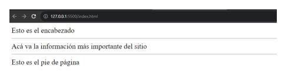
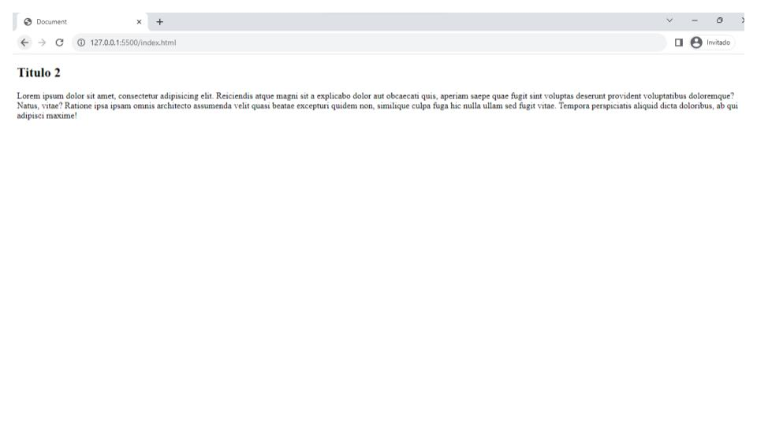
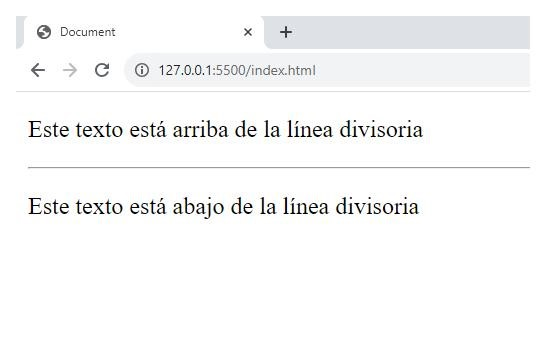

# HTML5

**Indice**<a id='indice'></a>
1. [¿Qué es HTML?](#id1)
2. [Estructura de una página HTML](#id2)
3. [Etiquetas](#id3)
4. [Referencias](#id4)
<hr/>

**¿Qué es HTML?**<a id='id1'></a><br>
**HTML (Lenguaje de Marcas de Hipertexto, del inglés HyperText Markup Language):** es el componente más básico de la Web. Define el significado y la estructura del contenido web.
Hay que tener en cuenta que es un lenguaje de marcado, <strong>no</strong> un lenguaje de programación. 
<br/>
<strong>HyperText (ó Hipertexto)</strong>, hace referencia a los enlaces que conectan páginas web entre sí, dentro de un único sitio web o entre sitios web. Los enlaces son un aspecto fundamental de la Web. 
<br/>
<strong>Markup (ó Marcas),</strong> son las etiquetas que permiten mostrar el contenido en un navegador Web, estas etiquetas pueden ser de texto, imágenes, videos, audios, etc. Las etiquetas consisten en el nombre del elemento rodeado por "<" y ">"

<hr/>

**Estructura de una página HTML**<a id='id2'></a><br>
Como dijimos anteriormente las "instrucciones" HTML están encerradas entre los caracteres "<" y ">".
Muchos elementos requieren una etiqueta de comienzo y otra de finalización. 

La estructura básica de una página HTML es:
<br>
<br> 


En sí, una página HTML es un archivo que tiene como extensión ".html". Generalmente el archivo principal de todo proyecto web es el "index.html". 
Ahora, en todo archivo HTML actual, la estructura se divide en las siguientes etiquetas:
 1.**\<!DOCTYPE html>**: esta etiqueta informa el navegador que el contenido que sigue se trata de un archivo HTML.<br>
 2. **\<html>\</html>**: una indica el inicio del archivo y la segunda marca el fin del mismo. Todo archivo HTML se encuentra divido en dos secciones, las mismas se detallan a continuación.<br>
 3. **\<head>\</head>**: la primera de las secciones de todo archivo HTML es la cabecera, es único por documento. En ella se coloca: <br>
    * **\<title>\</title>**: esta etiqueta contiene el título de la página, este aparece en la barra superior de nuestro navegador o en de la pestaña en la que tengamos abierto el proyecto.<br>
    * **\<meta>**: de esta etiqueta podemos tener varias, cada una indicando información sobre el documento. Son muy importantes para los motores de búsquedas, por lo que mejoraría nuestro SEO del sitio.<br>
    * **\<link>**: sirve para establecer una relación entre el documento actual y un recurso externo. Puede ser usado para enlazar hojas de estilo (.css).<br>
 4. **\<body>\</body>**: esta es la segunda sección importante de nuestro documento HTML, también de este elemento puede haber solamente uno. Todo lo que se coloque dentro de esta etiqueta es lo que se va a mostrar en el navegador. Algunas de las etiquetas que se colocan en esta sección se detallaran en la siguiente sección [Etiquetas](#id3). 
<hr/>

**Etiquetas**<a id='id3'></a>
<br>
En esta sección vamos a describir las etiquetas utilizadas más comunes, lo vamos a realizar en función de una estructuración de un archivo HTML, no en forma alfabética.<br>
Para eso debemos definir que la sección **\<body>\</body>**, por lo general, se encuentra divido en tres partes, las que son: 
1. **\<header>\</header>**: representa un conjunto de elementos que se colocarán en el encabezado del proyecto.
2. **\<main>\</main>**: dentro de estas etiquetas va el contenido principal del documento o aplicación. Este contenido es el que está directamente relacionado al tema central que motivó el proyecto
3. **\<footer>\</footer>**: representa un pie de página. Típicamente contiene información acerca de el autor, derechos de autor o enlaces a documentos relacionados.<br>
<br>
```html           
    <body>
      <header>Esto es el encabezado</header>
      <main>Acá va la información más importante del sitio</main>
      <footer>Esto es el pie de página</footer>
    </body>
  ```    

<br>
Dentro de las etiquetas anteriores se pueden colocar otras, que son las que vamos a describir a continuación:

* **\<nav>\</nav>**: el propósito de esta etiqueta es agrupar enlaces de navegación, ya sea hacia dentro del documento o a documentos externos
  ```html           
    <nav>
      <a href="https://www.google.com">Google</a>
      <a href="https://www.bing.com">Bing</a>
      <a href="https://www.yahoo.com">Yahoo!</a>
    </nav>
  ```    
  

* **\<section>\</section>**: sirve para determinar que contenido corresponde a qué parte de un esquema. Es una etiqueta semántica, por lo que permite estructurar semánticamente un documento a la hora de ser representado.
  ```html
  <section>
    <article>
      <h2>Título2</h2>
      <p>Lorem ipsum dolor sit amet consectetur adipisicing elit. Sequi, ut fuga perferendis corporis ea ab, esse iure, officiis soluta labore maiores illo animi deleniti error hic nam laborum officia repellendus.
      Eius debitis dolor, ullam doloribus eos quaerat cumque, nemo repudiandae perferendis commodi laboriosam voluptates et. Atque quas veniam fuga magnam doloribus, in facere saepe corporis quo, numquam, iure doloremque iusto!</p>
    </article>
  </section>
  ```
  

* **\<article>\<article>**: representa a un elemento que se quiere que sea distribuíble y/o reutilizable de manera independiente, por ejemplo: un mensaje en un foro, un artículo de revista o periódico, una entrada de blog, un widget, o cualquier otro elemento de contenido independiente.
  ```html
  <article>
    <h2>Titulo 2</h2>
    <p>Lorem ipsum dolor sit amet, consectetur adipisicing elit. Reiciendis atque magni sit a explicabo dolor aut obcaecati quis, aperiam saepe quae fugit sint voluptas deserunt provident voluptatibus doloremque? Natus, vitae?
    Ratione ipsa ipsam omnis architecto assumenda velit quasi beatae excepturi quidem non, similique culpa fuga hic nulla ullam sed fugit vitae. Tempora perspiciatis aliquid dicta doloribus, ab qui adipisci maxime!</p>
  </article>
  ```
  

* **\<aside>\</aside>**: determina una sección de una página que abarca contenido que está indirectamente relacionado con el contenido principal del documento. Suele representarse como barras laterales y contener una explicación al margen como un glosario, publicidad, enlaces a blos relacionados, etc.
  ```html
  <aside>
    <h3>Aquí hay una aside</h3>
    <p>Esto se utiliza como columnas laterales para publicidad o índice</p>
  </aside>
  ```
  

* **\<h1>\</h1>, \<h2>\</h2>, \<h3>\</h3>, \<h4>\</h4>, \<h5>\</h5>, \<h6>\</h6>**: este tipo de etiquetas sirven para estableces encabezados o títulos, son 6 tipos que van de la más importante <strong>\<h1></strong> a la de menos impotancia <strong>\<h6></strong>.
  ```html
    <h1>Título 1</h1>
    <h2>Título 2</h2>
    <h3>Título 3</h3>
    <h4>Título 4</h4>
    <h5>Título 5</h5>
    <h6>Título 6</h6>
  ```
  
* **\<p>\</p>**: este tipo de etiqueta nos sirve para distribuir el texto en párrafos.
  ```html
    <p>Lorem ipsum dolor sit amet consectetur adipisicing elit. Sequi, ut fuga perferendis corporis ea ab, esse iure, officiis soluta labore maiores illo animi deleniti error hic nam laborum officia repellendus.
    Eius debitis dolor, ullam doloribus eos quaerat cumque, nemo repudiandae perferendis commodi laboriosam voluptates et. Atque quas veniam fuga magnam doloribus, in facere saepe corporis quo, numquam, iure doloremque iusto!
    </p>
  ```
  

* **\<b>\</b>**: con esta etiqueta ponemos en negrita todo el contenido textual que abarca.
  ```html
    <b>Este texto se mostrará en negrita</b>
  ```
  

* **\<br>**: sirve para establecer un salto de línea en el texto. Es útil para textos en donde la división de las líneas es importante.
  ```html
    <p>Esto es una línea</p><br>
    <p>Esto está en la línea de abajo</p>
  ```
  

* **\<hr/>**: representa un cambio de tema entre párrafos. Suele representarse con una línea horizontal, y actualmente es definida en términos semánticos y no tanto en términos representativos.
  ```html
    <p>Este texto está arriba de la línea divisoria</p>
    <hr/>
    <p>Este texto está abajo de la línea divisoria</p>
  ```
  

* **\<a href="">\</a>**: con esta etiqueta creamos un enlace a otras páginas de internet, a archivos o a ubicaciones dentro de la misma página, a direcciones de correo o a cualquier otra URL.
  ```html
    <a href="https://www.google.com">Google</a>
  ```
  

* **\**: con esta etiqueta podemos insertar una imagen en el documento. Tiene que tener un atributo obligatorio que es src, este atributo nos especifica la URL de la imagen, esta URL puede ser externa o una dirección interna del proyecto.
  ```html
    
  ```
  

* **\<ol>\</ol>**: existen dos formas de establecer listas, una forma es con esta etiqueta en la que generamos listas ordenadas, ya sea numérica o alfabéticamente. 
  ```html
    <ol>
      <li>item 1</li>
      <li>item 2</li>
      <li>item 3</li>
      <li>item 4</li>
    </ol>
  ```
  

* **\<ul>\</ul>**: la otra opción de generar listas es con esta etiqueta, que nos permite crear una lista no ordenada.
  ```html
    <ul>
      <li>item 1</li>
      <li>item 2</li>
      <li>item 3</li>
      <li>item 4</li>
    </ul>
  ```
  

* **\<li>\</li>**: con esta etiqueta definimos cada item o elemento de una lista.
  ```html
    <li>item 1</li>
  ```
  

* **\<table>\</table>**: representa datos en dos o más dimensiones, creando la estructura de una tabla. Estas etiquetas abarcan otras que nos permiten incorporar elementos para el armado de la tabla.
  * **\<tr>\</tr>**: esta etiqueta define una fila de celdas en una tabla, incorpora elementos **\<td>** y **\<th>**
  * **\<th>\</th>**: con esta etiqueta definimos una celda como encabezado de un grupo de celdas en una tabla.
  * **\<td>\</td>**: este elemento permite definir la celda de una tabla, esta va a contener los datos que deseamos mostrar.
  ```html
    <table>
      <thead>
        <tr>
          <th colspan="2">Encabezado de la tabla abarcando dos columnas</th>
        </tr>
      </thead>
      <tbody>
        <tr>
          <td>Cuerpo de la tabla</td>
          <td>con dos columnas</td>
        </tr>
      </tbody>
    </table>
  ``` 
  <table>
    <thead>
      <tr>
        <th colspan="2">Encabezado de la tabla abarcando dos columnas</th>
      </tr>
    </thead>
    <tbody>
      <tr>
        <td>Cuerpo de la tabla</td>
        <td>con dos columnas</td>
      </tr>
    </tbody>
  </table>

* **\<audio>\</audio>**: se usa para insertar contenido de audio en el documento HTML.
```html
  <audio controls src="./assets/t-rex-roar.mp3">
    <a href="./assets/t-rex-roar.mp3"> Download audio </a>
  </audio>
```
  

* **\<video>\</video>**: esta etiqueta es utilizada para insertar videos en el documento HTML.
```html
  <video controls  width="500">
    <source src="./assets/flower.webm" type="video/webm" />
    <source src="./assets/flower.mp4" type="video/mp4" />
  </video>
``` 

  
* **\<iframe>\</iframe>**: con esta etiqueta podemos insertar otra página HTML en la actual, es muy útil a la hora de insertar mapas, videos, etc.
```html
  <iframe src="https://www.google.com/maps/embed?pb=!1m18!1m12!1m3!1d10364.686746264202!2d-65.2123881727468!3d-26.835186883924028!2m3!1f0!2f0!3f0!3m2!1i1024!2i768!4f13.1!3m3!1m2!1s0x94225d3ad7f30f1d%3A0xf8606cd659b8e3e4!2sRollingCode%20School!5e0!3m2!1sit!2sar!4v1700835370873!5m2!1sit!2sar" width="400" height="300" style="border:0;" allowfullscreen="" loading="lazy" referrerpolicy="no-referrer-when-downgrade"></iframe>
```
  <iframe src="https://www.google.com/maps/embed?pb=!1m18!1m12!1m3!1d10364.686746264202!2d-65.2123881727468!3d-26.835186883924028!2m3!1f0!2f0!3f0!3m2!1i1024!2i768!4f13.1!3m3!1m2!1s0x94225d3ad7f30f1d%3A0xf8606cd659b8e3e4!2sRollingCode%20School!5e0!3m2!1sit!2sar!4v1700835370873!5m2!1sit!2sar" width="400" height="300" style="border:0;" allowfullscreen="" loading="lazy" referrerpolicy="no-referrer-when-downgrade"></iframe>

* **\<div>\</div>**: se utiliza para crear secciones o agrupar contenidos, no tiene peso semántico, por eso hay que tratar de evitar el uso desmedido de esta etiqueta.
```html
  <div>Esto es un div</div>
```
* **\<form>\</form>**: con este elemento podemos representar un formulario que contenga los controles interactivos, representados con etiquetas específicas, que permitan al usuario enviar información a un servidor web.
  * **\<input>**: es una de las más utilizadas como componente de un **\<form>**, nos permite crear controles interactivos con el fin de recibir datos del usuario. Hay varios tipos de entrada y widgets de control, teniendo una amplia variedad de combinaciones y atributos de entrada.
  * **\<label>\</label>**: es un tipo de etiqueta que nos permite colocar un texto de referencia a un elemento control con un atributo determinado "for" o ubicando el elemento control dentro del **\<label>**.
```html
  <form action="" method="get" class="form-example">
    <div class="form-example">
      <label for="name">Enter your name: </label>
      <input type="text" name="name" id="name" required />
    </div>
    <div class="form-example">
      <label for="email">Enter your email: </label>
      <input type="email" name="email" id="email" required />
    </div>
    <div class="form-example">
      <input type="submit" value="Subscribe!" />
    </div>
  </form>
```
  <form action="" method="get" class="form-example">
    <div class="form-example">
      <label for="name">Nombre y Apellido: </label>
      <input type="text" name="name" id="name" required />
    </div>
    <div class="form-example">
      <label for="email">Correo electrónico: </label>
      <input type="email" name="email" id="email" required />
    </div>
    <div class="form-example">
      <input type="submit" value="Suscribase!" />
    </div>
  </form>

<hr/>

**Referencias**<a id='id4'></a>
<br>
<li><a href="https://developer.mozilla.org/en-US/docs/Web/HTML">MDN</a></li><br>
<li><a href="https://www.w3schools.com/html/default.asp">W3Schools</a></li><br>

